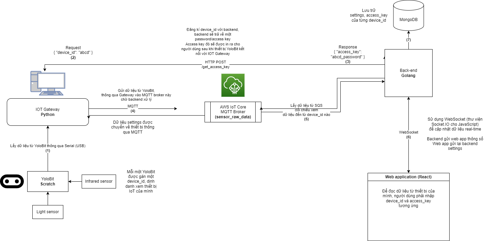

# Human Detector IoT System
Detects human using IoT devices. This repository includes:
1. Controller code for YoloBit and its sensor
2. A IoT Gateway to receive input from YoloBit and forwards it to a message broker using MQTT
3. A back-end that accounts for authentication, data processing and distribution
4. A web application for user interaction

# Architecture

