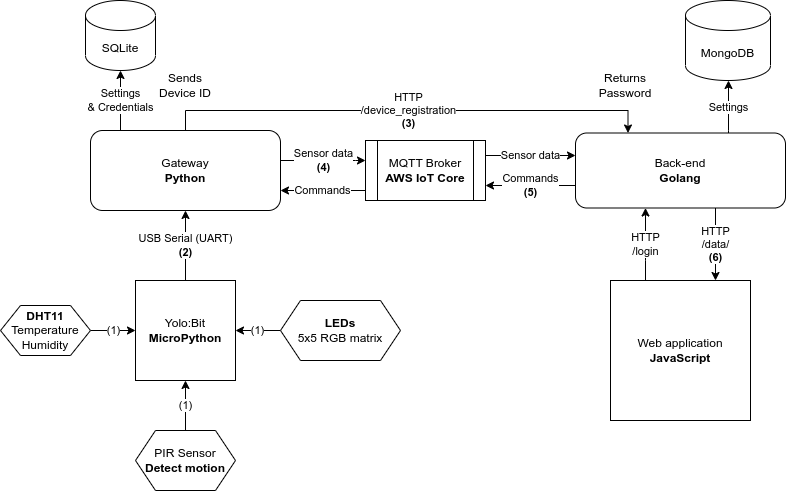

# Danger Detection IoT System
Detects danger using IoT devices. This repository includes:
1. Controller code for YoloBit and its sensor
2. A IoT Gateway to receive input from YoloBit and forwards it to a message broker using MQTT
3. A back-end that accounts for authentication, data processing and distribution
4. A web application for user interaction

# Architecture


# Sử dụng Docker Compose
Để khởi động & setup tất cả service cùng lúc.

**Lưu ý**: Đọc tất cả các `README.md` trong `api`, `gateway`, `app` trước.
Tại project root (tại nơi chứa `README.md` này)
```
docker compose up --build
```
